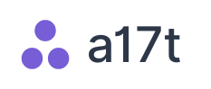

<p align="center">
  <h3 align="center"></h3>

  <p align="center">
    <br>
    An atomic design toolkit for pragmatists.
    <br>
    <i>A Tailwind CSS plugin.</i>
    <br>
    <a href="https://a17t.miles.land"><strong>Discover a17t »</strong></a>
    <br>
    <br>
    <a href="https://a17t.miles.land/#concepts">Concepts</a>
    &bull;
    <a href="https://www.jsdelivr.com/package/npm/a17t">CDN</a>
    &bull;
    <a href="https://miles.land/officehours/">Office Hours</a>
  </p>
</p>

## Installation
a17t is available on [NPM](https://www.npmjs.com/package/a17t), and can be installed with `npm install a17t` and installed in Tailwind by adding `require("a17t")` to the `plugins` section of your `tailwind.config.js` file. For more information, check out the [documentation site](https://a17t.miles.land).

## Overview

**Build beautiful, unique interfaces without reinventing the wheel. Let a17t provide the core building blocks, then customize with ease.**

```html
<article class="card ~positive @high">
  <!-- ~positive is for tone; @high is for priority -->
  
  <b>Congratulations!</b>
  You're using a17t to build a beautiful interface.
  
  <button class="button">Let's go!</button>
  
</article>
```

[View the full documentation &rarr;](https://a17t.miles.land)

Some CSS frameworks come prepackaged with all sorts of components that are convenient at first but quickly become limiting. Utility frameworks like Tailwind are awesome, but can be difficult start using on their own.

a17t tries to get the balance right. Instead of providing all-inclusive, opinionated components (like jumbotrons, navbars, and menus), a17t provides common single-class elements in a default (but easily customizable) style. And it's a Tailwind plugin, so it'll integrate into your project seamlessly.

## Getting Started
Want to jump right in? **Check out the [documentation site](https://a17t.miles.land) to get started.** Here are links to some popular elements:

* **Buttons** available [here](https://a17t.miles.land/interaction/button).
* **Cards** available [here](https://a17t.miles.land/layout/card).
* **Fields** available [here](https://a17t.miles.land/interaction/field).
* **Content** available [here](https://a17t.miles.land/typography/content).


## Documentation
a17t loves documentation. There's nearly 100% documentation coverage! View it [online](https://a17t.miles.land) or in the [docs folder](docs/).

---

a17t was created by [Miles McCain](https://rmrm.io) at the [Recurse Center](https://recurse.com).
